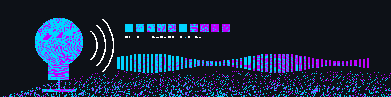
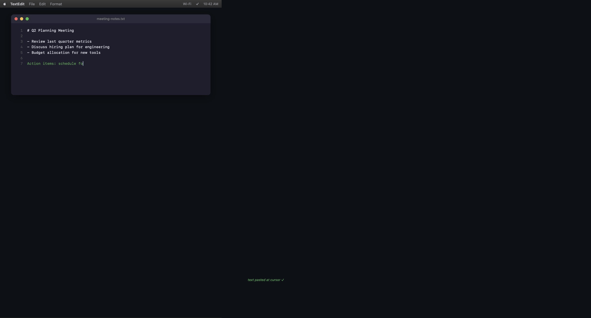

<p align="center">
  
</p>

<p align="center">
  <strong>voice → text, invisibly</strong>
</p>

<p align="center">
  
  
  
  
  
</p>

<p align="center">
  <em>A lightweight macOS menu bar app for system-wide voice-to-text transcription.<br>
  Hold a hotkey, speak, and your words appear at your cursor.<br>
  Uses your own API keys - no subscription required.</em>
</p>

---

# WhisperHUD

## Demo

Add a short demo GIF or video before going public. If you drop a file at `assets/demo.gif`, you can enable this block:

<!--
<p align="center">
  
</p>
-->

## Features

- **Hold-to-record**: Press `Cmd+Shift+Space` anywhere to start recording
- **Auto-transcribe**: Use cloud or local providers (OpenAI, Gemini, Apple, Whisper Local, Parakeet)
- **Auto-paste**: Transcribed text appears instantly at your cursor
- **Visual feedback**: Menu bar icon and optional HUD show recording/processing status
- **Auto-stop**: Optionally stop recording automatically after silence
- **Translation**: Local (Ollama) or cloud (Gemini/OpenAI) translation into 50+ languages
- **Streaming display**: See live text as it's transcribed and translated
- **Secure**: API keys stored in macOS Keychain, never in files
- **Cost tracking**: See your usage and estimated costs in the menu

## Quick Start

```bash
git clone https://github.com/jvogan/whisper-hud.git
cd whisper-hud
./install.sh
./run.sh
```

### Optional extras (local engines)

If you want local transcription engines, install extras after setting up the venv:

```bash
cd whisper-hud
source venv/bin/activate
pip install -e ".[whisper-local]"   # Whisper Local (faster-whisper)
pip install -e ".[parakeet]"        # Parakeet (Apple Silicon)
```

The setup wizard will guide you through:
1. Granting Accessibility permission (required for hotkey + paste)
2. Adding your API key (optional if using local providers)

That's it! Hold `Cmd+Shift+Space` to record.

## Permissions

WhisperHUD needs two macOS permissions to work properly:

- **Accessibility**: System Settings → Privacy & Security → Accessibility
- **Microphone**: System Settings → Privacy & Security → Microphone

## Getting API Keys

Only needed if you use cloud providers (OpenAI/Gemini).

### Google Gemini (Free tier available)
1. Go to [aistudio.google.com/apikey](https://aistudio.google.com/apikey)
2. Create a new API key
3. Free tier includes generous usage limits

### OpenAI
1. Go to [platform.openai.com/api-keys](https://platform.openai.com/api-keys)
2. Create a new API key
3. Add billing/credits to your account

## Usage

| Action | How |
|--------|-----|
| Start recording | Hold `Cmd+Shift+Space` |
| Stop & transcribe | Release the hotkey (or wait for auto-stop) |
| Click to record | Enable floating button in Settings |

The transcribed text is automatically pasted wherever your cursor is.

## Menu Bar Icons

| Icon | Status |
|------|--------|
| Mic | Ready |
| Red circle | Recording |
| Hourglass | Processing |
| Checkmark | Success |
| X | Error |

## Settings

Access settings from the menu bar icon:

**Transcription**
- **Provider**: Choose cloud or local providers (OpenAI, Gemini, Apple, Whisper Local, Parakeet)
- **Model**: Select transcription model (affects accuracy and cost)

**Recording**
- **Auto-stop on silence**: Automatically stop after you stop speaking
- **Silence duration**: How long to wait before auto-stopping (1-3 seconds)

**Display**
- **Show floating button**: Optional click-to-record widget
- **Widget size**: Small, medium, large, or extra-large
- **Show HUD overlay**: Visual feedback during recording
- **Streaming display**: Show live text panel during transcription

**Output**
- **Auto-paste**: Automatically paste transcribed text
- **Restore clipboard**: Restore previous clipboard contents after paste
- **Play sound**: Audio feedback on completion
- **Save history**: Store recent transcriptions locally (disabled by default)

**Translation** (Ollama local or cloud)
- **Provider**: Ollama (local), Gemini, or OpenAI
- **Enable translation**: Translate transcriptions before pasting
- **Target language**: Language to translate into (50+ supported)
- **Translation model**: Choose an Ollama size (4B/12B/27B) or a cloud model

## Translation Feature

WhisperHUD can translate your transcriptions locally using [Ollama](https://ollama.ai), or via cloud providers (Gemini/OpenAI).
Local translation keeps data on-device; cloud translation sends text to the provider.

### Enabling Translation
1. Go to Settings > Translation
2. Select a provider:
   - **Ollama (local)**: WhisperHUD can install/start Ollama and download a model (~3-18GB)
   - **Gemini/OpenAI (cloud)**: Requires API key, no local model download
3. Enable translation
4. Select your target language
5. Transcribe as usual - text will be translated before pasting

### Ollama Translation Models
| Model | Size | Speed | Quality |
|-------|------|-------|---------|
| translategemma-4b | ~3GB | Fast | Good |
| translategemma-12b | ~8GB | Medium | Better |
| translategemma-27b | ~18GB | Slower | Best |

### Supported Languages
Arabic, Chinese, Dutch, French, German, Hindi, Indonesian, Italian, Japanese, Korean, Polish, Portuguese, Russian, Spanish, Turkish, Ukrainian, Vietnamese

## Streaming Display

Enable "Streaming display" in Settings to see a live panel showing:
- Transcription text as it's recognized
- Translation text as it's generated (when translation enabled)

The panel auto-dismisses after text is pasted.

## Estimated Costs

| Provider | Model | Cost |
|----------|-------|------|
| OpenAI | GPT-4o Transcribe | ~$0.006/min |
| OpenAI | GPT-4o Mini Transcribe | ~$0.003/min |
| OpenAI | Whisper v2 | ~$0.006/min |
| Google | Gemini 2.0 Flash | ~$0.001/min |

Typical usage (30 seconds of speech): $0.001 - $0.003

**Local translation is free** (Ollama). Cloud translation uses your provider's pricing.

## Security

- **API keys** are stored in macOS Keychain (encrypted, system-protected)
- **Audio** is processed in memory and never saved to disk; cloud providers receive audio/text when selected
- **Local providers** (Apple, Whisper Local, Parakeet, Ollama) keep data on-device
- **History** is disabled by default; enabling it stores recent transcriptions locally in `~/.config/whisper-hud/`
- **Settings** are stored locally in `~/.config/whisper-hud/`
- **No telemetry** or data collection
- **Accessibility permission** is powerful; only grant it to trusted apps

## Assets & Attribution

If you use any third-party assets in `assets/`, list sources and licenses in `assets/ATTRIBUTIONS.md`.

## Requirements

- macOS 12+ (Monterey or later)
- Python 3.11+
- OpenAI/Gemini API key if you use cloud providers (not required for local providers)
- Homebrew (optional, for Ollama translation)

## Troubleshooting

### Quick fixes

- **Hotkey not working**: Check Accessibility permission and avoid shortcut conflicts.
- **Mic not working**: Grant Microphone permission.

### "This process is not trusted"
Grant Accessibility permission: System Settings > Privacy & Security > Accessibility

Add your terminal app (Terminal, iTerm, VS Code, etc.) to the list.

### "Could not open audio device"
Grant Microphone permission: System Settings > Privacy & Security > Microphone

### Hotkey doesn't work
1. Make sure no other app is using `Cmd+Shift+Space`
2. Check Accessibility permissions are granted
3. Try restarting the app

### Transcription fails
1. Verify your API key is valid
2. Check you have credits/billing enabled (OpenAI)
3. Check your internet connection

### Translation not working
1. Ensure Homebrew is installed: [brew.sh](https://brew.sh)
2. Check Ollama is running (menu bar should show it)
3. Verify the model downloaded completely
4. Try a smaller model if you have limited disk space

### App won't start
```bash
# Check for errors
cd whisper-hud && source venv/bin/activate && python -m whisper_hud.main
```

### Reinstall dependencies
```bash
cd whisper-hud/whisper-hud
rm -rf venv
python3 -m venv venv
source venv/bin/activate
pip install -r requirements.txt
```

## Documentation

- **[API Providers Guide](docs/API_PROVIDERS.md)** - Compare transcription & translation options
- **[Keyboard Shortcuts](docs/KEYBOARD_SHORTCUTS.md)** - Hotkey reference and customization
- **[Troubleshooting](docs/TROUBLESHOOTING.md)** - Common issues and solutions
- **[Contributing](CONTRIBUTING.md)** - How to contribute to WhisperHUD

## License

MIT License - see [LICENSE](LICENSE) for details.

## Author

Jacob Vogan
