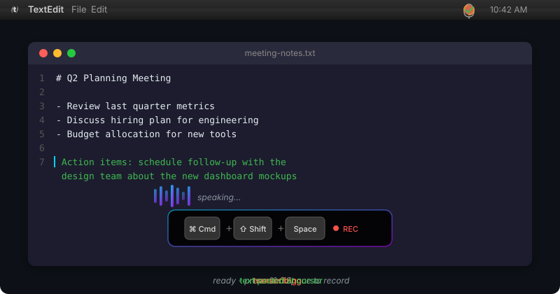

<p align="center">
  
</p>

<p align="center">
  <strong>voice → text, invisibly</strong>
</p>

<p align="center">
  
  
  
  
  
</p>

<p align="center">
  <em>System-wide voice-to-text for macOS.<br>
  Hold a hotkey anywhere, speak, and text appears at your cursor.<br>
  No subscription. No account. Bring your own API keys — or use it fully local for free.</em>
</p>

---

<p align="center">
  
</p>

---

## Why WhisperHUD?

- **Works everywhere** — dictate into any app, any text field, any terminal. System-wide, not app-specific.
- **Free local option** — choose Apple Speech (built-in, no API key, no cost) and start transcribing in 30 seconds.
- **Private by default** — no telemetry, no data collection. Local providers keep everything on-device. Cloud keys are encrypted at rest.
- **No subscription** — bring your own API keys. Typical cloud cost: **$0.001 per dictation**.
- **50+ language translation** — transcribe in one language, paste in another. Local or cloud.

## Quickstart

```bash
./install.sh
```

That's it. On first launch, choose **Apple (Built-in)** to start free with zero setup — or configure a cloud provider for higher accuracy.

<details>
<summary><strong>First-time macOS permissions</strong> (one-time setup)</summary>

macOS requires three permissions for WhisperHUD to work:

1. **Accessibility** — System Settings → Privacy & Security → Accessibility → enable WhisperHUD or your terminal
2. **Microphone** — System Settings → Privacy & Security → Microphone → enable WhisperHUD or your terminal
3. **Automation** — on first paste, click OK when macOS asks to control System Events

If a prompt was dismissed, re-enable it in System Settings → Privacy & Security → Automation.
</details>

## Providers

| Provider | Type | Setup | Cost |
|----------|------|-------|------|
| **Apple Speech** | Local | None — built into macOS | Free |
| **Whisper Local** | Local | `pip install -e ".[whisper-local]"` | Free |
| **Parakeet** | Local | `pip install -e ".[parakeet]"` (Apple Silicon) | Free |
| **Google Gemini** | Cloud | [Get API key](https://aistudio.google.com/apikey) (free tier) | ~$0.001/min |
| **OpenAI Whisper** | Cloud | [Get API key](https://platform.openai.com/api-keys) | ~$0.003-0.006/min |
| **OpenAI Realtime** | Cloud | Same OpenAI key — live streaming | Realtime pricing |

Typical usage (30s of speech): **$0.001 - $0.003** with cloud providers. Local providers are completely free.

## How It Works

| Action | How |
|--------|-----|
| Start recording | Hold `Cmd+Shift+Space` |
| Stop & transcribe | Release the hotkey (or wait for auto-stop) |
| Click to record | Enable floating button in Settings |

Text is automatically pasted wherever your cursor is. The menu bar icon shows status: ready, recording, processing, or done.

## Features

**Core** — Hold-to-record with auto-transcribe and auto-paste. Visual feedback via menu bar icon and optional HUD overlay. Auto-stop on silence. Streaming display shows live text as it's recognized.

**Translation** — Transcribe in one language, paste in another. 50+ languages supported. Local translation via Apple Translation (macOS 26+) or Ollama keeps data on-device. Cloud translation via Gemini, OpenAI, or Anthropic.

**Privacy & Security** — Three API key storage modes: passphrase-encrypted (default), macOS Keychain, or session-only. Audio processed in memory. Local providers never send data off-device. No telemetry or data collection. Files saved with user-only permissions.

**Extras** — Cost tracking in the menu bar. Configurable floating record button. Character packs for widget customization. Launch at login support.

## Comparison

| | WhisperHUD | macOS Dictation | Superwhisper | Whisper.cpp CLI |
|---|---|---|---|---|
| System-wide paste | Yes | Yes | Yes | No (manual copy) |
| Bring your own key | Yes | N/A | No (subscription) | N/A |
| Local + cloud providers | Both | Local only | Both | Local only |
| Translation built-in | Yes (50+ langs) | No | No | No |
| Streaming preview | Yes | Yes | Yes | No |
| Cost | Free / BYOK | Free | $8-16/mo | Free |
| Open source | Yes (MIT) | No | No | Yes |

## Getting API Keys

<details>
<summary><strong>Google Gemini</strong> (free tier available)</summary>

1. Go to [aistudio.google.com/apikey](https://aistudio.google.com/apikey)
2. Create a new API key
3. Free tier includes generous usage limits
</details>

<details>
<summary><strong>OpenAI</strong></summary>

1. Go to [platform.openai.com/api-keys](https://platform.openai.com/api-keys)
2. Create a new API key
3. Add billing/credits to your account

OpenAI Realtime uses the same API key as batch transcription.
</details>

<details>
<summary><strong>Anthropic</strong> (translation only)</summary>

1. Go to [console.anthropic.com/settings/keys](https://console.anthropic.com/settings/keys)
2. Create a new API key
3. Add billing/credits to your account
</details>

## Documentation

| Doc | Description |
|-----|-------------|
| [Settings](docs/SETTINGS.md) | All settings, translation setup, streaming display |
| [API Providers](docs/API_PROVIDERS.md) | Provider comparison and configuration |
| [Keyboard Shortcuts](docs/KEYBOARD_SHORTCUTS.md) | Hotkey reference and customization |
| [Troubleshooting](docs/TROUBLESHOOTING.md) | Common issues and solutions |
| [FAQ](docs/FAQ.md) | Frequently asked questions |
| [Developer Guide](docs/DEVELOPER.md) | Contributing, architecture, building from source |
| [Security](SECURITY.md) | Security model and vulnerability reporting |

## Requirements

- macOS 12+ (Monterey or later; Apple Translation requires macOS 26+)
- Python 3.11+
- Cloud API key only if using cloud providers (not required for Apple Speech, Whisper Local, or Parakeet)

## License

MIT License — see [LICENSE](LICENSE) for details.

## Contributing

See [CONTRIBUTING.md](CONTRIBUTING.md) for how to contribute. All contributors welcome.
